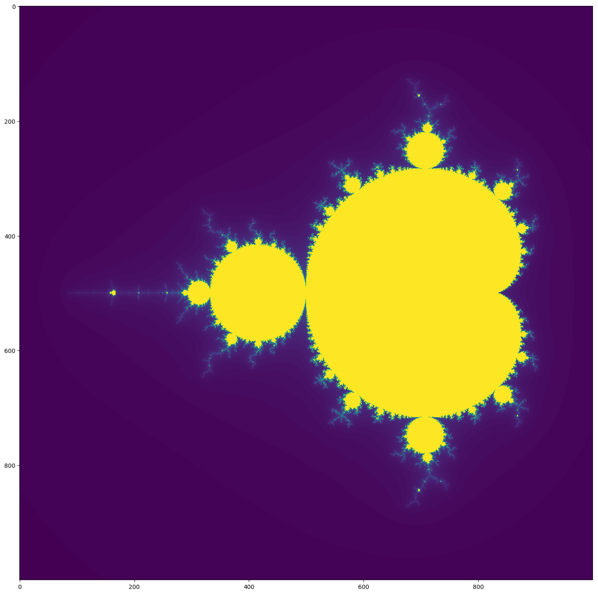

## Explaining Mandelbrot

###### note: All the functions are derived from or based on code in PYTHON: MAKE YOUR OWN MANDELBROT SET By Tariq Rashid Some information on the functions is also from this article.

### Import Statements


```python
import matplotlib.pyplot as pyplot
import numpy as np
```

#### These import statements bring the "modules" needed to display the Mandelbrot. Pyplot is the module that will display the final product. Numpy helps with organizing all of the data into arrays.

### Some Python introductory functions

#### -Insert Explanation Here- (I'm pretty sure I was told NOT to include these. I will make sure.)


```python
# start code under review for deletion
def helloworld():
    print('Hello World!')
    
def variables():
    x = 10
    print(x)
    print(x+5)
    print(z)
    
def forloop():
    for n in range(10):
        print(n)
    print('done')

def morefor():
    for n in range(10):
        print('The square of',n,'is',n*n)
    print("done")

#end code under review for deletion
```

### The Mandel Function

#### This function is the most important function here. It has 2 arguments, c and maxiter. c is a complex number that will be fed to this function later in the process. maxiter is the maximum amount of iterations that the function can do. It takes c, and finds after how many iterations it will leave the circle, which in this case has a radius of 4, however that can be changed. The last thing it does is return that info to the function that called it


```python
def mandel(c, maxiter):
    z = complex(0,0)
    iteration = 0
    while iteration <= maxiter:
        z = (z*z) + c
        iteration = iteration + 1
        if abs(z) > 4:
            break
    
    return iteration
```

### Creating The Atlas

#### This function starts by taking 2 ranges of numbers, and how many parts you want the sets divided by. The linspace function does this. The next part prints these numbers so we can see what linspace did. We then repeat this with 2 new sets, however these are now divided into 1000 parts. We then get the size of these lists by using len on the list of values. We then create an empty atlas with the same size of the xvalues and yvalues put together. The 2 for loops in the next section go through all of the xvalues and yvalues, make a complex number out of them, puts the complex number into mandel (the c from earlier!), and finally inputs the results into the atlas. This is repeated until the atlas is full. The atlas is then returned.


```python
def createAtlas():
    xlist = np.linspace(-2.0, 4.0, 13)
    ylist = np.linspace(-2.0, 2.0, 9)
    for x in xlist:
        for y in ylist:
            print(x,y)
            
    xvalues = np.linspace(-2.25, 0.75, 1000)
    yvalues = np.linspace(-1.5, 1.5, 1000)
    
    xlen = len(xvalues)
    ylen = len(yvalues)
    
    atlas = np.empty((xlen,ylen))
    
    for ix in range(xlen):
        for iy in range(ylen):
            
            cx = xvalues[ix]
            cy = yvalues[iy]
            c = complex(cx,cy)
            
            atlas[ix,iy] = mandel(c, 120)
            
    return atlas
```

### Showing the Mandelbrot Set

#### The final step is to actually show the Mandelbrot! We start by creating a pyplot figure with a size of 18,18 and a resolution of 100 dots per inch. We then transcribe the atlas into python by putting atlas.T, and we set the interpolation to spline36 to smooth out the final product. We then enter our final command, show.


```python
def showMandel(atlas):
    fig = pyplot.figure(figsize = (18,18), dpi = 100)
    pyplot.imshow(atlas.T, interpolation='spline36')
    pyplot.show()
```

### Putting It All Together!

#### This final function takes everything we have done so far, and puts it together. It takes the atlas from when we created it, and feeds it to pyplot! Simple enough!


```python
def fullMandel():
    atlas = createAtlas()
    showMandel(atlas)
```

### The final product

#### We first start with that list of x and y values from earlier, but when we scroll down, we see the results of all of this hard work. A Mandelbrot.


```python
fullMandel()
```

    -2.0 -2.0
    -2.0 -1.5
    -2.0 -1.0
    -2.0 -0.5
    -2.0 0.0
    -2.0 0.5
    -2.0 1.0
    -2.0 1.5
    -2.0 2.0
    -1.5 -2.0
    -1.5 -1.5
    -1.5 -1.0
    -1.5 -0.5
    -1.5 0.0
    -1.5 0.5
    -1.5 1.0
    -1.5 1.5
    -1.5 2.0
    -1.0 -2.0
    -1.0 -1.5
    -1.0 -1.0
    -1.0 -0.5
    -1.0 0.0
    -1.0 0.5
    -1.0 1.0
    -1.0 1.5
    -1.0 2.0
    -0.5 -2.0
    -0.5 -1.5
    -0.5 -1.0
    -0.5 -0.5
    -0.5 0.0
    -0.5 0.5
    -0.5 1.0
    -0.5 1.5
    -0.5 2.0
    0.0 -2.0
    0.0 -1.5
    0.0 -1.0
    0.0 -0.5
    0.0 0.0
    0.0 0.5
    0.0 1.0
    0.0 1.5
    0.0 2.0
    0.5 -2.0
    0.5 -1.5
    0.5 -1.0
    0.5 -0.5
    0.5 0.0
    0.5 0.5
    0.5 1.0
    0.5 1.5
    0.5 2.0
    1.0 -2.0
    1.0 -1.5
    1.0 -1.0
    1.0 -0.5
    1.0 0.0
    1.0 0.5
    1.0 1.0
    1.0 1.5
    1.0 2.0
    1.5 -2.0
    1.5 -1.5
    1.5 -1.0
    1.5 -0.5
    1.5 0.0
    1.5 0.5
    1.5 1.0
    1.5 1.5
    1.5 2.0
    2.0 -2.0
    2.0 -1.5
    2.0 -1.0
    2.0 -0.5
    2.0 0.0
    2.0 0.5
    2.0 1.0
    2.0 1.5
    2.0 2.0
    2.5 -2.0
    2.5 -1.5
    2.5 -1.0
    2.5 -0.5
    2.5 0.0
    2.5 0.5
    2.5 1.0
    2.5 1.5
    2.5 2.0
    3.0 -2.0
    3.0 -1.5
    3.0 -1.0
    3.0 -0.5
    3.0 0.0
    3.0 0.5
    3.0 1.0
    3.0 1.5
    3.0 2.0
    3.5 -2.0
    3.5 -1.5
    3.5 -1.0
    3.5 -0.5
    3.5 0.0
    3.5 0.5
    3.5 1.0
    3.5 1.5
    3.5 2.0
    4.0 -2.0
    4.0 -1.5
    4.0 -1.0
    4.0 -0.5
    4.0 0.0
    4.0 0.5
    4.0 1.0
    4.0 1.5
    4.0 2.0




