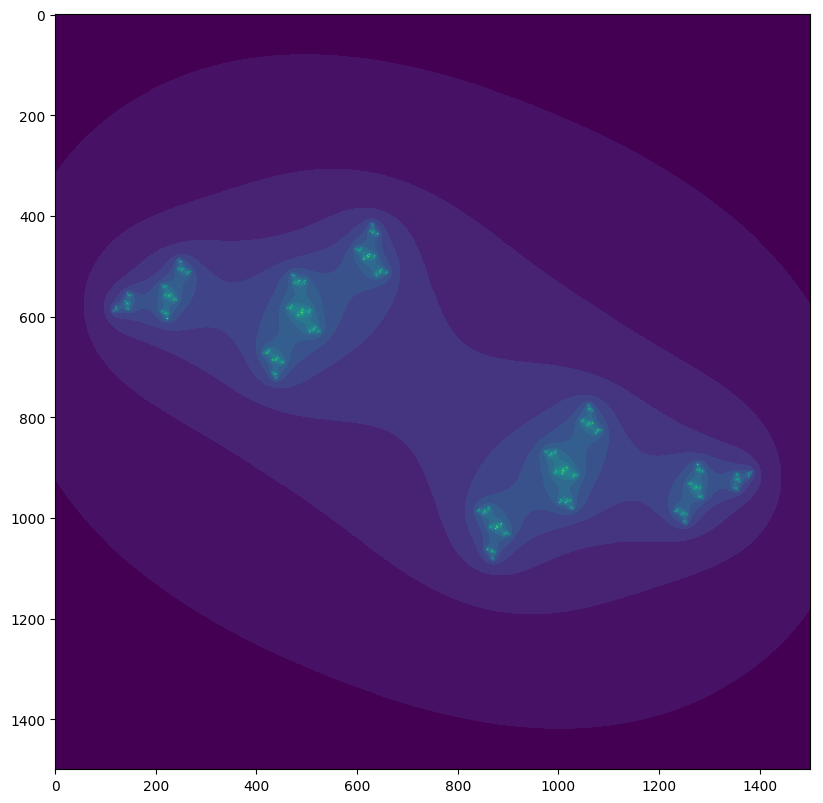
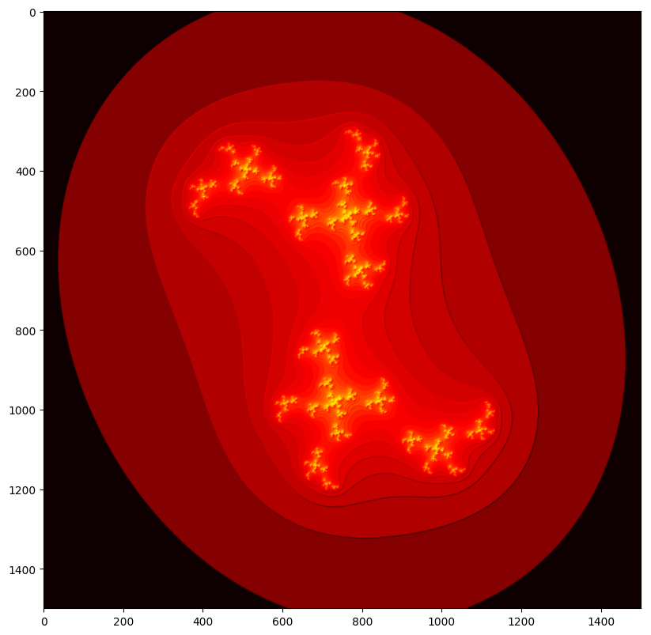
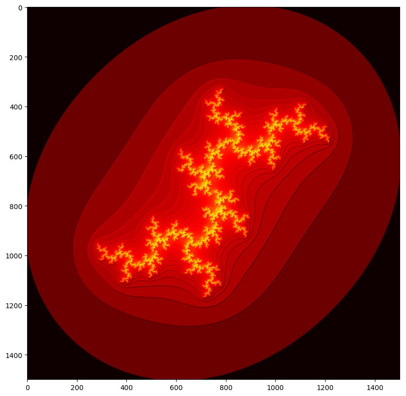
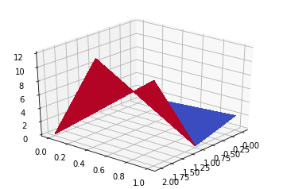
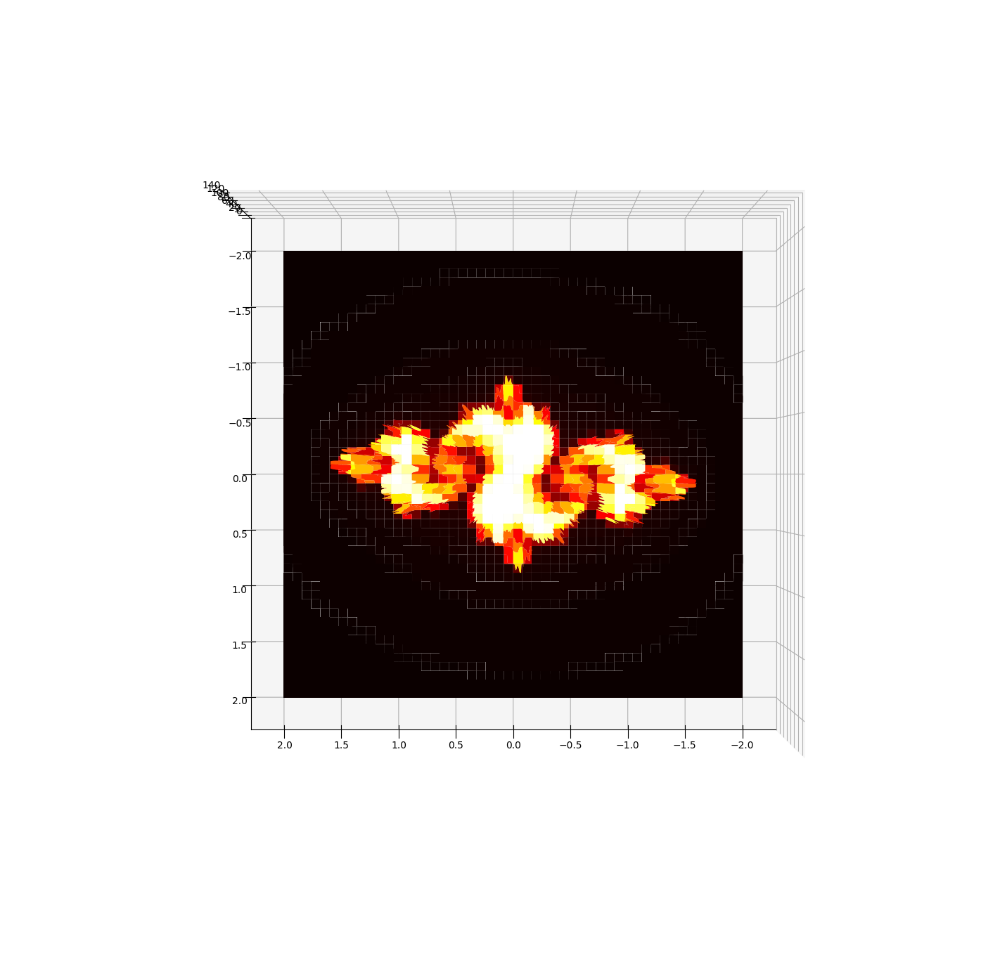
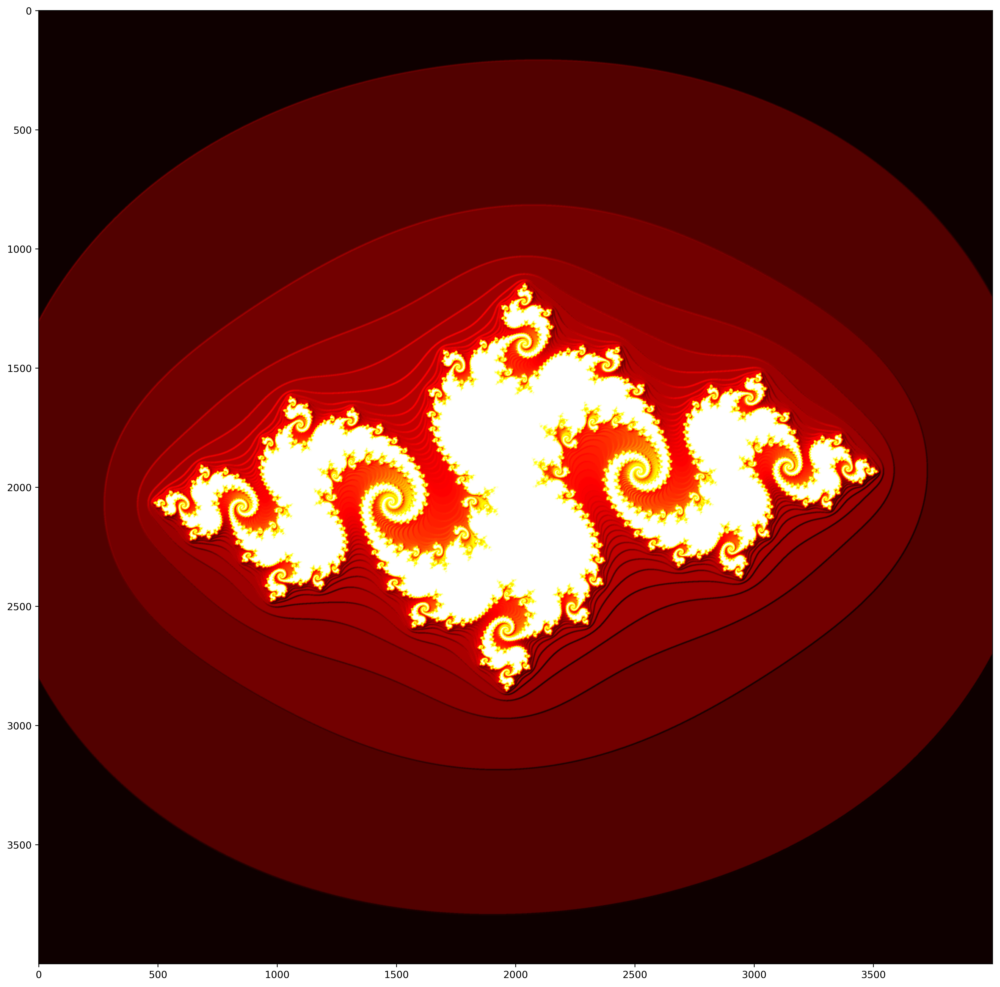

# Julia Set Program
First Import Cell - The first cell in this program imports the needed modules to complete this program


```python
import matplotlib.pyplot as pyplot
from matplotlib import colors
import math
import cmath
import numpy as np
import random
from mpl_toolkits.mplot3d import Axes3D
import scipy.ndimage
```

### Julia Program
The second cell basically tests when will the complex point inputed will fall out of the complex circle with a radius of 4. It does this by taking the complex point and squaring it and adding it to another complex number. It keeps doing this until it reaches the maxiter or that it falls out of the circle. It then returns the iteration it ends on. This is basically testing if the number is converging or diverging away from the origin.


```python
def julia(z, c, maxiter):
    for iteration in range(maxiter):
        z = (z**2) + c
        if abs(z)>4:
            break
    return iteration
```

### Creating the Atlas
The third cell creates an atlas of entries and tests them in the julia program. First the cell sets up values for x and y using the linspace function which takes in two numbers as beginning and end, and then takes the amount of cuts you want to make in between the two numbers, this gives you a list of numbers between your start and end. The third line sets up a random complex number for the julia program. xlen and ylen test how long xvalues and yvalues are. The lengths are then used to create an array of the size xlen by ylen full of zeros in the form of place holders. The for loops now are choosing every position in the array one by one and pulling numbers from xvalues and yvalues to create a new complex number called z. The for loop now accesses the atlas at [ix, iy] and inputs the iterations of z according to the julia program.


```python
xvalues = np.linspace(-2, 2, 1500)
yvalues = np.linspace(-2, 2, 1500)
c = complex(random.randrange(-1, 1),random.randrange(-1, 1))
xlen = len(xvalues)
ylen = len(yvalues)
atlas = np.empty((xlen, ylen))
for ix in range(xlen):
    for iy in range(ylen):
        cx = xvalues[ix]
        cy = yvalues[iy]
        z = complex(cx, cy)
        atlas[ix,iy] = julia(z, c, 90)
```

### Showing the Julia Set
The next cell sets up a figure of the right size and transforms the atlas into something that can be transposed onto a 2d graph and then shows the figure


```python
fig = pyplot.figure(figsize=(10,10), dpi = 100)
pyplot.imshow(atlas.T,interpolation = "nearest")
pyplot.show()
```





### Compiled Julia Sets Program
The next cell is just a compilation of all the code from the above put into one function, with the addition of everything being a variable so that it is completely cutomizable. a new thing is that there is now collor added on lines 14 and 15.


```python
def juliaSets(c, maxiter = 90, xRangeBegin = -2, xRangeEnd = 2, yRangeBegin = -2, yRangeEnd = 2, cutBreak = 1500):
    xvalues = np.linspace(-2, 2, 1500)
    yvalues = np.linspace(-2, 2, 1500)
    xlen = len(xvalues)
    ylen = len(yvalues)
    atlas = np.empty((xlen, ylen))
    for ix in range(xlen):
        for iy in range(ylen):
            cx = xvalues[ix]
            cy = yvalues[iy]
            z = complex(cx, cy)
            atlas[ix,iy] = julia(z, c, 90)
    fig = pyplot.figure(figsize=(10,10), dpi = 100)
    light = colors.LightSource(azdeg = 315, altdeg = 20)
    atlas = light.shade(atlas.T, cmap = pyplot.cm.hot, vert_exag = 10, norm = colors.PowerNorm(0.5), blend_mode = "overlay")
    pyplot.imshow(atlas,interpolation = "bicubic")
    pyplot.show()
```

### Tests
The next two cells just test the above cell with different c values


```python
juliaSets(complex(0.43, -0.57))
```





```python
juliaSets(0.7885 * cmath.exp(1j * cmath.pi / 2))
```





```python
datax = np.arange(0, 2, 1)
datay = np.arange(0, 3, 1)
datay, datax = np.meshgrid(datax, datay)

dataArray = np.zeros([3, 2])
dataArray[0, 0] = int(1)
dataArray[0, 1] = int(2)
dataArray[1, 0] = int(9)
dataArray[2, 1] = int(12)
print(dataArray)
```

    [[  1.   2.]
     [  9.   0.]
     [  0.  12.]]


```python
fig = pyplot.figure()
ax = fig.gca(projection = "3d")
ax.view_init(30, 40)
surf = ax.plot_surface(datax, datay, dataArray, cmap = pyplot.cm.coolwarm, linewidth = 0, antialiased = False)
pyplot.show()
```





```python
datax = np.arange(-2, 2, 0.001)
datay = np.arange(-2, 2, 0.001)
graphx, graphy = np.meshgrid(datax, datay)
xlen = len(datax)
ylen = len(datay)
c = complex(-0.78662, 0.130477)
atlas = np.empty([xlen, ylen])
for ix in range(xlen):
    for iy in range(ylen):
        cx = datax[ix]
        cy = datay[iy]
        z = complex(cx, cy)
        atlas[ix, iy] = julia(z, c, 150)
        
print(np.shape(graphx))
print(np.shape(graphy))
print(np.shape(atlas))
```

    (4000, 4000)
    (4000, 4000)
    (4000, 4000)


```python
fig = pyplot.figure(figsize = (18, 18), dpi = 100)
ax = fig.gca(projection = "3d")
ax.view_init(90, 90)
smoothAtlas = scipy.ndimage.gaussian_filter(atlas.T, 2)
surf = ax.plot_surface(graphx, graphy, smoothAtlas, cmap = pyplot.cm.hot, linewidth = 0.1, antialiased = True)
pyplot.show()
```





```python
fig = pyplot.figure(figsize = (18, 18), dpi = 499)
light = colors.LightSource(azdeg = 315, altdeg = 20)
atlas = light.shade(smoothAtlas, cmap = pyplot.cm.hot, vert_exag = 10, norm = colors.PowerNorm(0.5), blend_mode = "overlay")
pyplot.imshow(atlas, interpolation = "nearest")
pyplot.show()
```


    <matplotlib.figure.Figure at 0x11a49c2e8>




