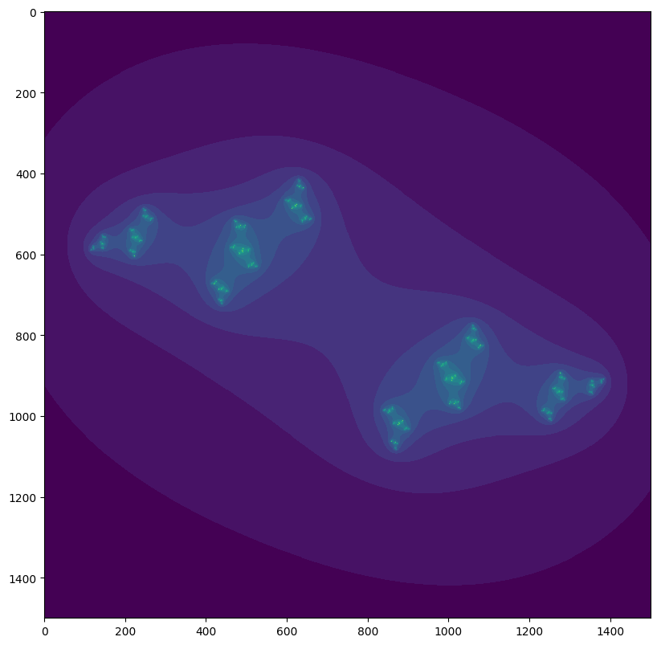
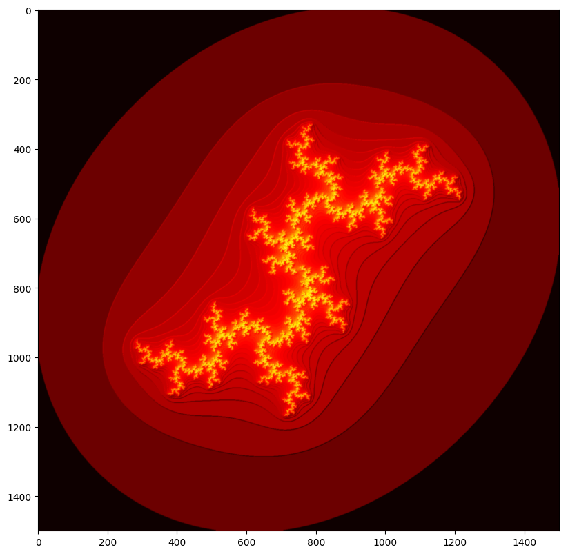
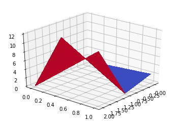
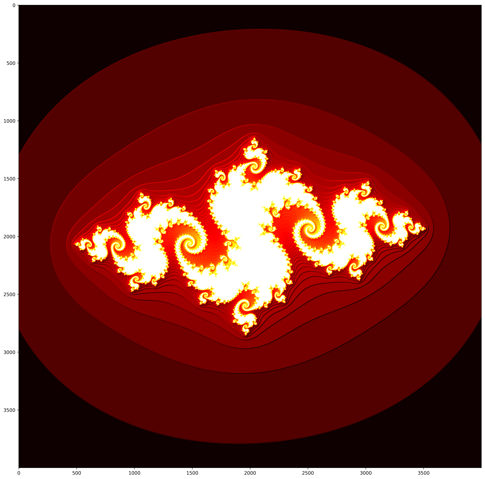

# Julia Set Program
First Import Cell - The first cell in this program imports the needed modules to complete this program


```python
import matplotlib.pyplot as pyplot
from matplotlib import colors
import math
import cmath
import numpy as np
import random
from mpl_toolkits.mplot3d import Axes3D
import scipy.ndimage
```


```python
def julia(z, c, maxiter):
    for iteration in range(maxiter):
        z = (z**2) + c
        if abs(z)>4:
            break
    return iteration
```


```python
xvalues = np.linspace(-2, 2, 1500)
yvalues = np.linspace(-2, 2, 1500)
c = complex(random.randrange(-1, 1),random.randrange(-1, 1))
xlen = len(xvalues)
ylen = len(yvalues)
atlas = np.empty((xlen, ylen))
for ix in range(xlen):
    for iy in range(ylen):
        cx = xvalues[ix]
        cy = yvalues[iy]
        z = complex(cx, cy)
        atlas[ix,iy] = julia(z, c, 90)
```


```python
fig = pyplot.figure(figsize=(10,10), dpi = 100)
pyplot.imshow(atlas.T,interpolation = "nearest")
pyplot.show()
```


```python
def juliaSets(c, maxiter = 90, xRangeBegin = -2, xRangeEnd = 2, yRangeBegin = -2, yRangeEnd = 2, cutBreak = 1500):
    xvalues = np.linspace(-2, 2, 1500)
    yvalues = np.linspace(-2, 2, 1500)
    xlen = len(xvalues)
    ylen = len(yvalues)
    atlas = np.empty((xlen, ylen))
    for ix in range(xlen):
        for iy in range(ylen):
            cx = xvalues[ix]
            cy = yvalues[iy]
            z = complex(cx, cy)
            atlas[ix,iy] = julia(z, c, 90)
    fig = pyplot.figure(figsize=(10,10), dpi = 100)
    light = colors.LightSource(azdeg = 315, altdeg = 20)
    atlas = light.shade(atlas.T, cmap = pyplot.cm.hot, vert_exag = 10, norm = colors.PowerNorm(0.5), blend_mode = "overlay")
    pyplot.imshow(atlas,interpolation = "bicubic")
    pyplot.show()
```


```python
juliaSets(complex(0.43, -0.57))
```





```python
juliaSets(0.7885 * cmath.exp(1j * cmath.pi / 2))
```


```python
datax = np.arange(0, 2, 1)
datay = np.arange(0, 3, 1)
datay, datax = np.meshgrid(datax, datay)

dataArray = np.zeros([3, 2])
dataArray[0, 0] = int(1)
dataArray[0, 1] = int(2)
dataArray[1, 0] = int(9)
dataArray[2, 1] = int(12)
print(dataArray)
```

    [[  1.   2.]
     [  9.   0.]
     [  0.  12.]]


```python
fig = pyplot.figure()
ax = fig.gca(projection = "3d")
ax.view_init(30, 40)
surf = ax.plot_surface(datax, datay, dataArray, cmap = pyplot.cm.coolwarm, linewidth = 0, antialiased = False)
pyplot.show()
```





```python
datax = np.arange(-2, 2, 0.001)
datay = np.arange(-2, 2, 0.001)
graphx, graphy = np.meshgrid(datax, datay)
xlen = len(datax)
ylen = len(datay)
c = complex(-0.78662, 0.130477)
atlas = np.empty([xlen, ylen])
for ix in range(xlen):
    for iy in range(ylen):
        cx = datax[ix]
        cy = datay[iy]
        z = complex(cx, cy)
        atlas[ix, iy] = julia(z, c, 150)
        
print(np.shape(graphx))
print(np.shape(graphy))
print(np.shape(atlas))
```

    (4000, 4000)
    (4000, 4000)
    (4000, 4000)


```python
fig = pyplot.figure(figsize = (18, 18), dpi = 100)
ax = fig.gca(projection = "3d")
ax.view_init(90, 90)
smoothAtlas = scipy.ndimage.gaussian_filter(atlas.T, 2)
surf = ax.plot_surface(graphx, graphy, smoothAtlas, cmap = pyplot.cm.hot, linewidth = 0.1, antialiased = True)
pyplot.show()
```





```python
fig = pyplot.figure(figsize = (18, 18), dpi = 499)
light = colors.LightSource(azdeg = 315, altdeg = 20)
atlas = light.shade(smoothAtlas, cmap = pyplot.cm.hot, vert_exag = 10, norm = colors.PowerNorm(0.5), blend_mode = "overlay")
pyplot.imshow(atlas, interpolation = "nearest")
pyplot.show()
```


    <matplotlib.figure.Figure at 0x11a49c2e8>




