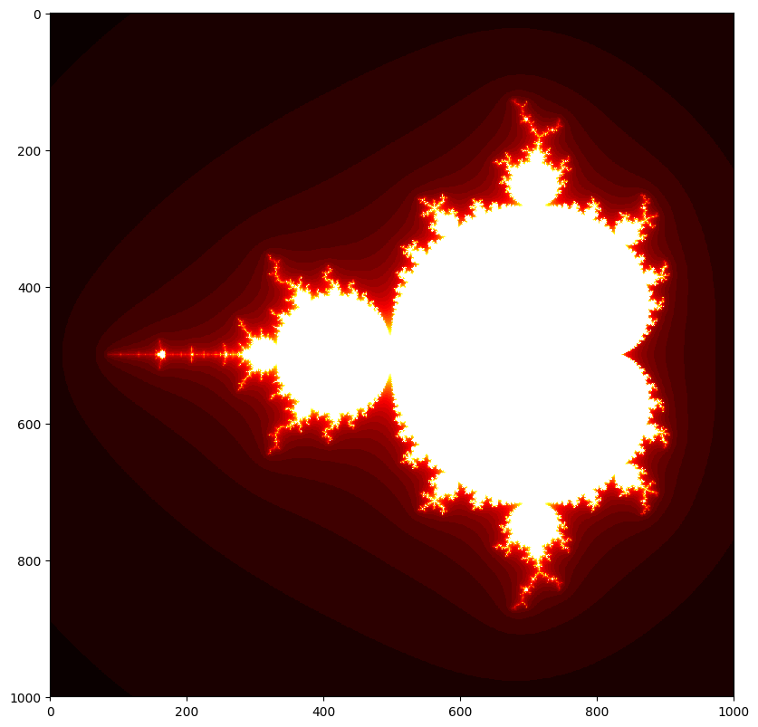
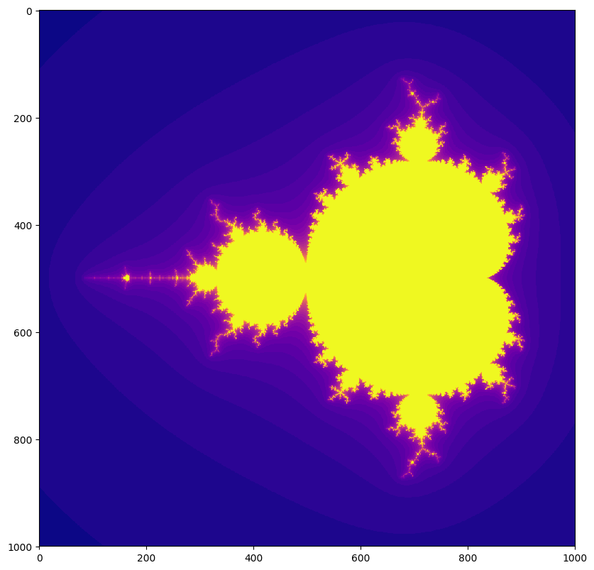
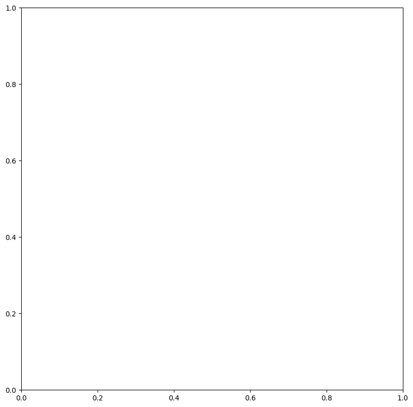
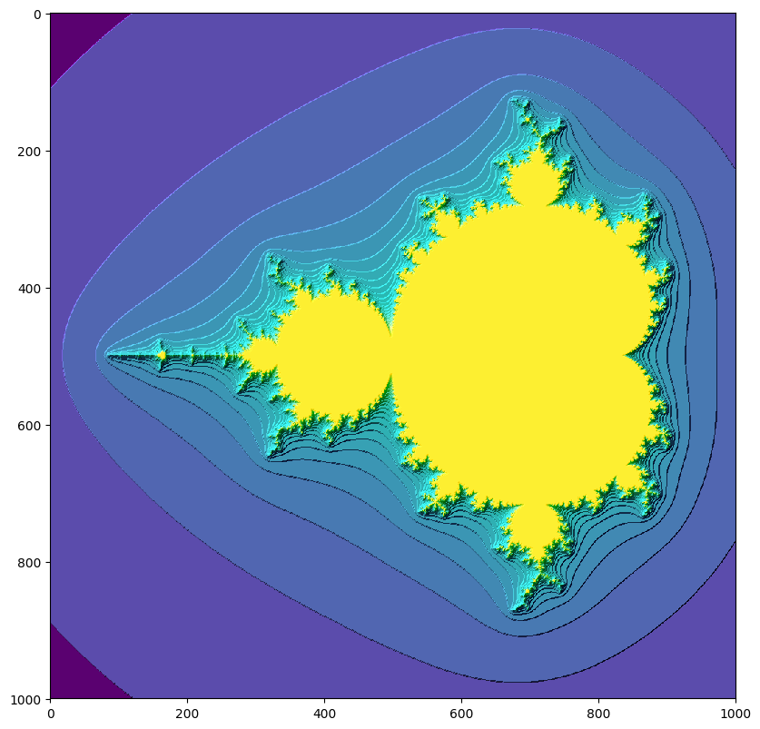
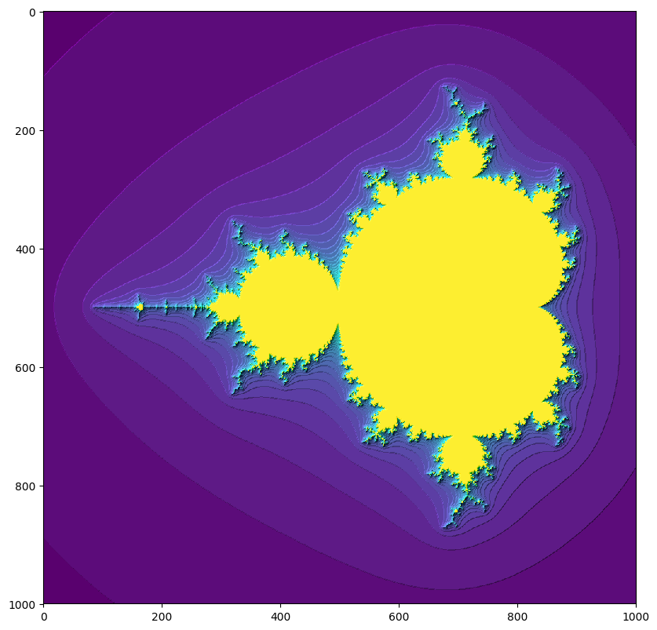
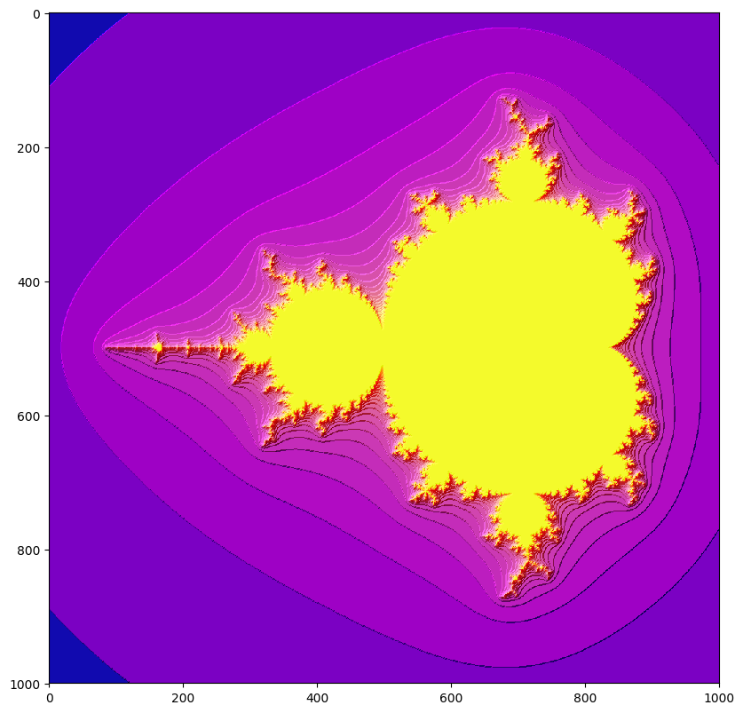

## Cmap
cmap - The cmap parameter used by the pyplot rendering process basically gives the user an option of different palettes of colors to choose from when rendering different images or graphs based on data, there also many different types of color maps used to portray multiple different types of data, like for a mandelbrot set you might use a more colorful cmap like inferno or viridis while for another graph you might use binary
for all of the cmap options go here: https://matplotlib.org/examples/color/colormaps_reference.html


```python
import matplotlib.pyplot as pyplot
from matplotlib import colors
import math
import cmath
import numpy as np
import random
from mpl_toolkits.mplot3d import Axes3D
import scipy.ndimage
```


```python
def mandel(c, maxiter):
    z = complex(0, 0)
    for iteration in range(maxiter):
        z = (z**2) + c
        if abs(z)>20:
            break
    return iteration
```


```python
def mandelset():
    xvalues = np.linspace(-2.25, 0.75, 1000)
    yvalues = np.linspace(-1.5, 1.5, 1000)
    xlen = len(xvalues)
    ylen = len(yvalues)
    atlas = np.empty((xlen, ylen))
    for ix in range(xlen):
        for iy in range(ylen):
            cx = xvalues[ix]
            cy = yvalues[iy]
            c = complex(cx, cy)
            atlas[ix,iy] = mandel(c, 40)
    fig1 = pyplot.figure(figsize=(10,10), dpi = 100)
    pyplot.imshow(atlas.T,interpolation = "nearest", cmap = pyplot.cm.hot)
    fig2 = pyplot.figure(figsize=(10,10), dpi = 100)
    pyplot.imshow(atlas.T,interpolation = "nearest", cmap = pyplot.cm.plasma)
    pyplot.show()

mandelset()
```








## Blend Mode
blend_mode - The blend_mode parameter just changes the type of shading that is on the particular graph or image you create, different graphs and images look better with different kinds of shading, smooth graphs look better under hsv while rough graphs are better with overlay
https://matplotlib.org/examples/pylab_examples/shading_example.html


```python
def mandelset():
    xvalues = np.linspace(-2.25, 0.75, 1000)
    yvalues = np.linspace(-1.5, 1.5, 1000)
    xlen = len(xvalues)
    ylen = len(yvalues)
    atlas = np.empty((xlen, ylen))
    for ix in range(xlen):
        for iy in range(ylen):
            cx = xvalues[ix]
            cy = yvalues[iy]
            c = complex(cx, cy)
            atlas[ix,iy] = mandel(c, 40)
    fig1 = pyplot.figure(figsize=(10,10), dpi = 100)
    light = colors.LightSource(azdeg = 315, altdeg = 20)
    atlas1 = light.shade(atlas.T, cmap = pyplot.cm.viridis, vert_exag = 10, norm = colors.PowerNorm(0.5), blend_mode = "overlay")
    pyplot.imshow(atlas1,interpolation = "nearest")
    atlas2 = light.shade(atlas.T, cmap = pyplot.cm.plasma, vert_exag = 10, norm = colors.PowerNorm(0.5), blend_mode = "overlay")
    fig2 = pyplot.figure(figsize=(10,10), dpi = 100)
    pyplot.imshow(atlas2,interpolation = "nearest")
    pyplot.show()

mandelset()
```













