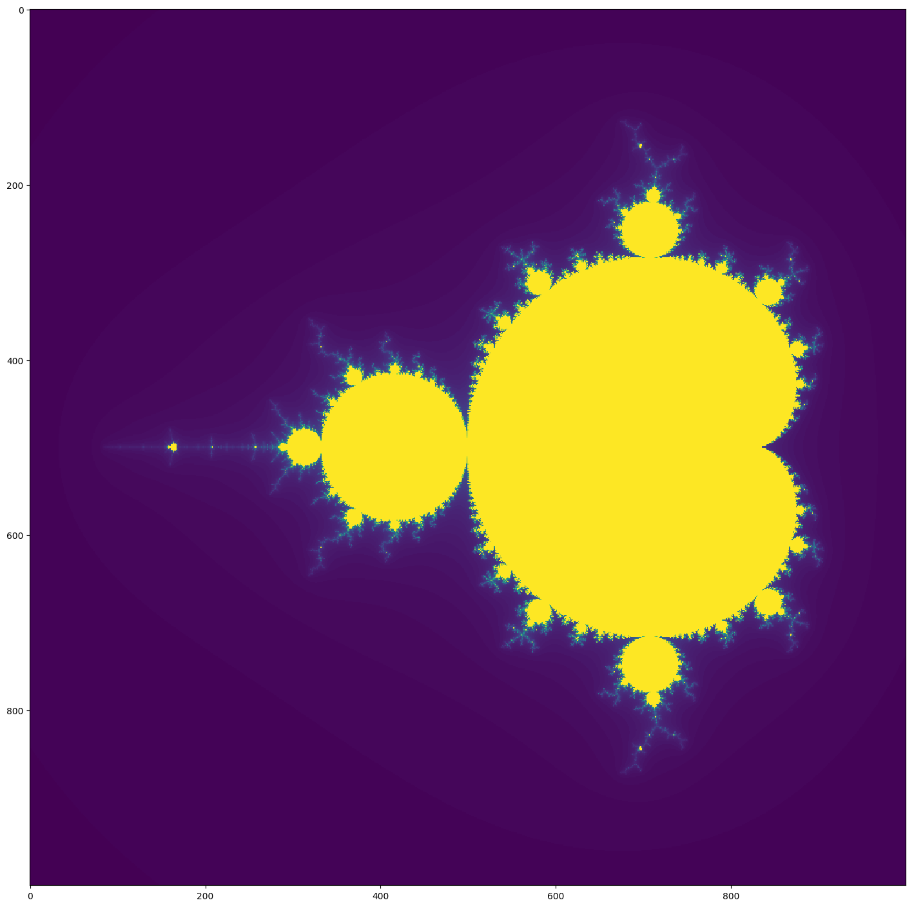
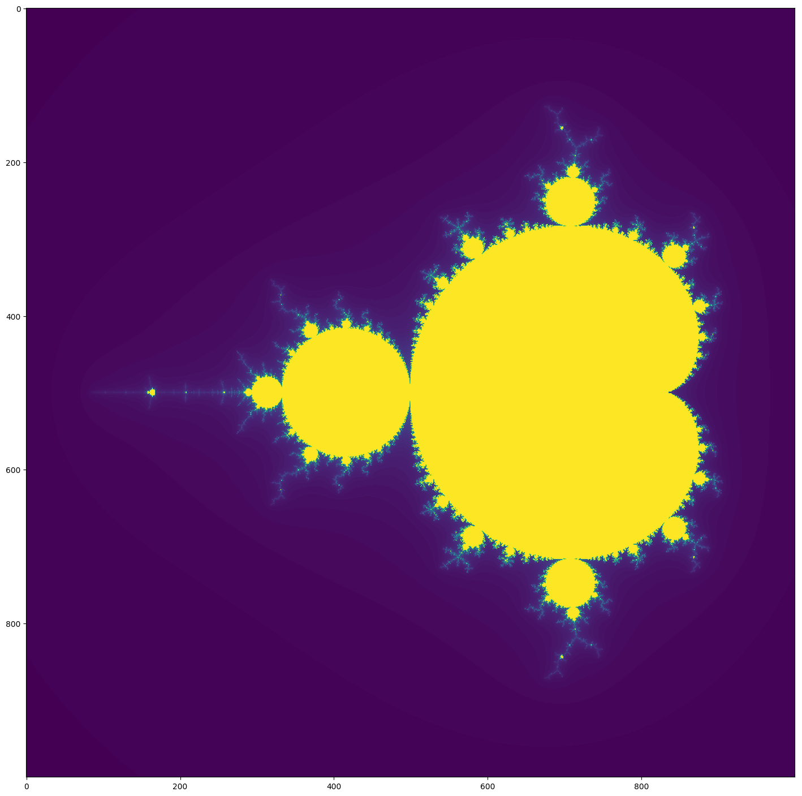

# Pyplot Interpolation

##### Mandelbrot code from Python: Make Your Own Mandelbrot Set By Tariq Rashid

### What is interpolation?

#### To put it simply, interpolation (in our case) is the smoothing of an image or graph using a mathematical formula to "guess" data points that were not initially given.

#### There are 16 different interpolation options in pyplot, but we will not be discussing all of them. You can explore more of the interpolation options at this page: https://matplotlib.org/gallery/images_contours_and_fields/interpolation_methods.html?highlight=interpolations%20imshow%20matshow


```python
import matplotlib.pyplot as pyplot
import numpy as np

def mandel(c, maxiter):
    z = complex(0,0)
    iteration = 0
    while iteration <= maxiter:
        z = (z*z) + c
        iteration = iteration + 1
        if abs(z) > 4:
            break
    
    return iteration

def createAtlas():
    xlist = np.linspace(-2.0, 4.0, 13)
    ylist = np.linspace(-2.0, 2.0, 9)
    for x in xlist:
        for y in ylist:
            break
            
    xvalues = np.linspace(-2.25, 0.75, 1000)
    yvalues = np.linspace(-1.5, 1.5, 1000)
    
    xlen = len(xvalues)
    ylen = len(yvalues)
    
    atlas = np.empty((xlen,ylen))
    
    for ix in range(xlen):
        for iy in range(ylen):
            
            cx = xvalues[ix]
            cy = yvalues[iy]
            c = complex(cx,cy)
            
            atlas[ix,iy] = mandel(c, 120)
            
    return atlas

def showMandel(atlas, inte):
    fig = pyplot.figure(figsize = (18,18), dpi = 100)
    pyplot.imshow(atlas.T, interpolation=inte)
    pyplot.show()

def fullMandel(inte):
    atlas = createAtlas()
    interp = input
    showMandel(atlas, inte) 
```

### None, none, and nearest


```python
fullMandel('none')
```





#### None is pretty self explanitory. It adds no interpolation, giving you a pixel perfect image. However, the image produced can be pixelated, as shown in the above image. none and nearest also give the same result.

### Bilinear


```python
fullMandel('bilinear')
```


#### Bilinear interplation creates a smoother image while also retaining some sharpness.

### Bicubic


```python
fullMandel('bicubic')
```


#### Bicubic interpolation is like bilinear interpolation, but creates a smoother and almost hazy image.

### Spline36


```python
fullMandel('spline36')
```





#### Spline36 is the perfect balance between sharpness and smoothness. You can still see detail, but there is also smoothing allowing for a closer look at the image.
